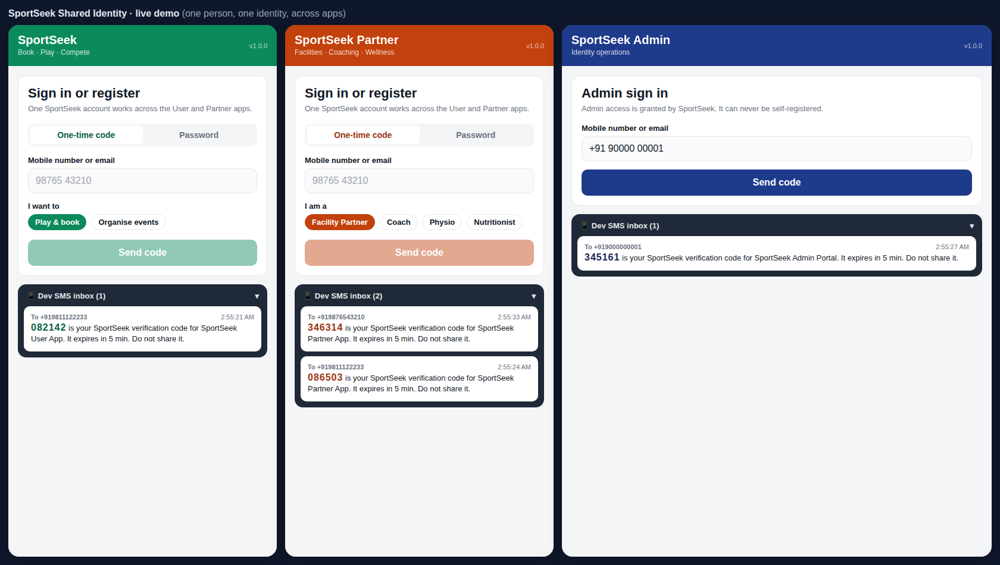
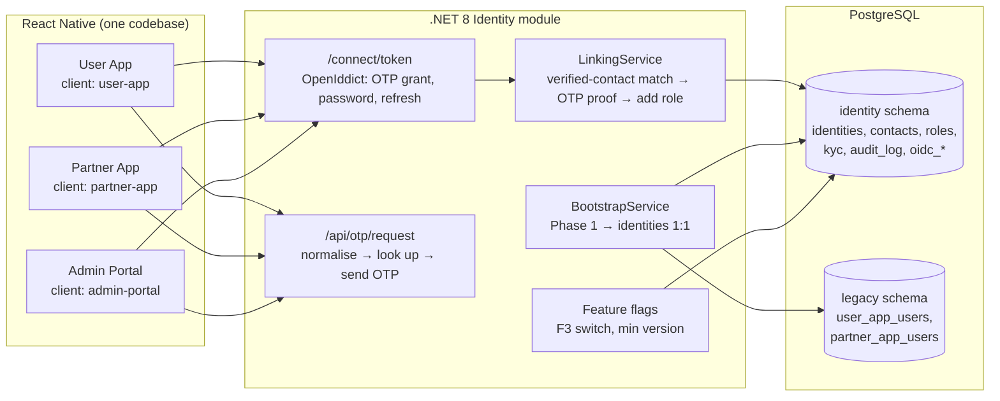

# F3 Shared Identity: proof of concept

A working proof of concept of **F3 Shared Identity & account linking** from the SportSeek Phase 2A Technical Approach (`docs/phase-2a/03_Technical_Approach`, §6.1 and ADR-01). It uses the confirmed SportSeek stack: **.NET (ASP.NET Core) + PostgreSQL + React Native**.

It proves the one claim that matters for F3: **one person has one identity across the User and Partner apps. Linking requires proof of ownership by OTP, and no duplicate account is ever created.**



## What it demonstrates

| # | Behaviour (Technical Approach reference) | Where you see it |
|---|---|---|
| 1 | Register on the User App with OTP; a new identity is created with the **Player** role | User App |
| 2 | The same phone registers on the Partner App: the existing identity is found, **ownership is proved by OTP**, and **Facility Partner is added to the same identity**. No second record (§6.1 "Account linking") | Partner App, Admin → Identities |
| 3 | A wrong OTP never links; 5 failures lock the number for 15 min; OTP requests are rate-limited per number and per IP (§6.1 "Authentication") | Partner App |
| 4 | **App-scoped tokens**: the User App token carries only Player, the Partner App token only partner roles. Each app is its own OIDC client (§6.1) | Profile → "What this app's token carries" |
| 5 | **KYC on the identity**: submitted once in the Partner App, visible in the User App (SOW §7.4) | Both apps, Admin verifies |
| 6 | **One credential**: a password set in one app works in the other, but a password never links a new app (OTP required) | Profile → Password; Password tab |
| 7 | Every identity and linking decision is **audit-logged** (§6.1 step 6) | Admin → Audit log |
| 8 | **Bootstrap (plan task 2.9)**: Phase 1 User and Partner accounts are loaded 1:1; duplicates are reported for the R2 merge, not merged | Admin → Phase 1 & bootstrap |
| 9 | A Phase 1 user proves their number and **claims their existing account**, KYC included | Partner App |
| 10 | **Remote switch (plan task 2.10)**: F3 off → apps fall back to the Phase 1 login; back on → nothing lost | Admin → Remote switch |
| 11 | **Minimum-version enforcement**: old app builds get "Update required" and the API answers 426 | Admin → Remote switch |
| 12 | The acceptance test the Technical Approach promises: *"existing User App phone registers on Partner App → same identity, role added, no duplicate"* | `tests/`, 13 automated tests |

## Stack

| Layer | POC | Technical Approach |
|---|---|---|
| Back end | ASP.NET Core 8 minimal API, C# | .NET modular monolith, Identity module |
| Identity provider | **ASP.NET Core Identity + OpenIddict 7** | ADR-01 leaning |
| Data | **PostgreSQL**, EF Core 8 + Npgsql, schema `identity` (domain-owned); simulated Phase 1 tables in schema `legacy` | Schema per domain |
| Mobile | **React Native + TypeScript** (Expo SDK 57): one codebase, three app variants; runs on phones (Expo Go) and in the browser | React Native apps |
| Tests | xUnit + `WebApplicationFactory`, against a real PostgreSQL database | xUnit + Testcontainers |



## Run it locally

### Prerequisites

- **.NET 8 SDK**: `dotnet --list-sdks` should show 8.0.x
- **Node.js 20+** (for the React Native app)
- **PostgreSQL** (any recent version) running locally
- Optional: the **Expo Go** app on your phone, to run the apps on a real device

### 1. Point the API at your PostgreSQL

Edit `api/appsettings.json` → `ConnectionStrings:Identity` with your user and password:

```json
"Identity": "Host=localhost;Port=5432;Database=sportseek_identity_poc;Username=postgres;Password=postgres"
```

The API creates the `sportseek_identity_poc` database, both schemas and all seed data on first start. The user needs permission to create a database. Alternatively, create the database yourself first.

### 2. Start the API (port 5080)

```bash
cd poc/identity/api
dotnet run
```

Check it: http://localhost:5080/api/config. OTP codes also print in this console.

### 3. Start the apps

```bash
cd poc/identity/app
npm install
npx expo start --web
```

Open **http://localhost:8081/?app=stage** for the demo stage (all three apps side by side), or open each app in its own tab:

- User App: http://localhost:8081/?app=user
- Partner App: http://localhost:8081/?app=partner
- Admin Portal: http://localhost:8081/?app=admin

**On a phone (Expo Go):** your phone and laptop must be on the same Wi-Fi. Tell the app where the API is, then scan the QR code:

```bash
# macOS / Linux
EXPO_PUBLIC_API_URL=http://<your-laptop-LAN-IP>:5080 npx expo start
# Windows PowerShell
$env:EXPO_PUBLIC_API_URL="http://<your-laptop-LAN-IP>:5080"; npx expo start
```

Allow port 5080 through the laptop firewall. The app opens on a launcher where you pick User App, Partner App or Admin Portal.

### Web front end (Lit) and the shareable prototype

`web-lit/` is a Lit web-components front end for the same three apps: User and Partner apps in phone frames and the Admin Portal in a browser window, on one demo stage. Below 1180px wide it switches to tabs, so it works on a phone. It has two builds:

```bash
cd poc/identity/web-lit
npm install
npm run build:proto   # dist/proto: shareable prototype, the Identity API runs in the browser (no server)
npm run serve         # dist/live on http://localhost:8082, talking to the .NET API on :5080
```

The prototype uses `app/src/mock/server.ts`, a browser port of the .NET linking, OTP and bootstrap rules. Each viewer's test data stays on their own device. Use it to share a clickable link, and use the live build against the real API for the actual demo.

The Expo app (`app/`) also has a prototype build (`npm run build:proto` there), kept for the React Native story.

### 4. Run the acceptance tests

```bash
cd poc/identity
dotnet test
```

Tests create a throwaway database per test class on `localhost` (user `postgres`, password `postgres`) and drop it afterwards. To use other credentials, set `IDENTITY_TEST_PG`, e.g. `Host=localhost;Port=5432;Username=me;Password=secret`.

## Demo script (about 10 minutes)

Open the **demo stage** (`?app=stage`). There is no SMS provider: each app has a **Dev SMS inbox** panel showing the code "sent" to the phone. Tap the highlighted message to fill the code in.

| Step | Do | Say |
|---|---|---|
| 1 | **User App**: enter `98111 22233`, keep "Play & book", **Send code**. Enter a name, tap the inbox code, **Verify & create account** | "A new player registers. One identity is created, with the Player role." |
| 2 | **Partner App**: enter the same number as `+91 98111 22233`, choose **Facility Partner**, **Send code** | "Different app, different format, same number. It's normalised and recognised: *Existing SportSeek account found*." |
| 3 | Type `000000` and **Verify & link account** | "Matching a number is not enough. Without proof of ownership nothing is linked. That's the account-takeover protection. Five failures lock the number." |
| 4 | Tap the inbox code, **Verify & link account** | "Ownership proved: Facility Partner is added to the *same* identity. No new account." Point at "Also on your account: Player · User App". |
| 5 | Partner App → **Show** the token panel | "Each app gets its own token with only its own roles. No silent SSO." |
| 6 | Partner App → KYC: PAN `ABCDE1234F`, **Submit**. Watch the **User App** | "KYC is on the identity, so the User App shows it immediately." |
| 7 | **Admin Portal**: the admin number is pre-filled (`+91 90000 00001`). **Send code**, use the code, sign in. Show **Identities** (one person, two app roles) and **Verify** the KYC | "One record, roles from two apps, KYC verified once. It turns green in both apps." |
| 8 | Admin → **Audit log** | "Every decision is recorded, with the reason: created, OTP failed, role linked, KYC submitted and verified." |
| 9 | Admin → **Phase 1 & bootstrap** → **Run bootstrap** | "Launch day: every existing account is loaded 1:1. Three people already had duplicate accounts. They are flagged for the R2 merge with approved rules, not merged blindly." |
| 10 | **Partner App** → Sign out → enter `98765 43210` (Arjun, Phase 1 partner) → code → verify | "An existing partner proves his number and gets his account, verified KYC included." |
| 11 | Admin → **Remote switch** → turn F3 **off**. Watch the apps | "If anything goes wrong at launch we switch F3 off: the apps fall back to the Phase 1 login (e.g. `98123 45678` / `demo1234`). Switch on: nothing lost." |
| 12 | Admin → Minimum version `1.1.0` → **Save**, then **Reset to 1.0.0** | "Old app versions in the field are told to update, and the API refuses them." |

To rehearse again: Admin → Remote switch → **Reset demo data**, then sign in to the Admin Portal again.

**Phase 1 seed data** (password `demo1234`, for the Phase 1 login): User App: Arjun Mehta `98765 43210`, Priya Nair `9123456780`, Rahul Verma `+91 99887 76655`, Sneha Iyer `9812345678`, Karan Singh `090011 22334`, Ananya Rao `9445566778`. Partner App: Arjun's Turf Arena `+91-9876543210`, Priya Tennis Coaching `09123456780`, Verma Sports Physio `9988776600`, Smash Badminton Hub `9876501234`, FitFuel Nutrition `9765432109`. Arjun and Priya share a phone across the apps, and Rahul shares an email: those are the planted duplicates.

## How the linking decision works

`api/Domain/LinkingService.cs`:

1. The identifier is normalised: phones to E.164 (default region India, via libphonenumber), emails lower-cased.
2. An OTP is sent. Nothing about any identity changes yet.
3. After the OTP is verified, the owner is found:
   - the identity holding it as a **verified** contact (a partial unique index, `ux_contacts_verified_value`, guarantees at most one);
   - otherwise a bootstrapped **Phase 1** identity holding it unverified. The one from the same app is preferred, and the contact becomes verified. Any other stays a duplicate candidate for R2.
4. If found, the app's role is **added** to that identity (`ROLE_LINKED`, with the reason). If not, a new identity is created (`IDENTITY_CREATED`).
5. The token for that app carries only that app's roles.

The Admin Portal can never self-register or grant itself Admin, and a password sign-in never adds a role.

## POC simplifications (not for production)

| POC | Production (per the Technical Approach) |
|---|---|
| Custom OTP grant on OpenIddict's token endpoint, so the OTP screens stay inside the React Native app | Authorization Code + PKCE (e.g. `react-native-app-auth`), with the OTP step on the identity server's pages |
| OTPs shown in a Dev SMS inbox and the console (Development environment only) | DLT-registered SMS templates via SportSeek's provider; codes never exposed |
| Ephemeral signing keys (tokens reset when the API restarts); unencrypted JWTs so the demo can show them | Certificates from the secrets store; encrypted or reference tokens as decided in the HLD |
| `EnsureCreated` builds the schema | EF Core migrations per module |
| The OTP request says whether a number already has an account (for the demo narrative) | Uniform responses, to avoid account enumeration |
| KYC stores a masked document number only | Evidence in restricted storage with access logging |
| HTTP on localhost, CORS open | TLS everywhere, restricted CORS, security headers, VAPT and the targeted identity pen test |
| Duplicates are detected and reported | R2: merge with SportSeek-approved rules, re-pointing bookings, events and partner records |

## Project layout

```
poc/identity/
├── SportSeek.Identity.sln
├── api/                          ASP.NET Core 8 Identity module
│   ├── Program.cs                OpenIddict server + validation, DI, rate limiting
│   ├── Data/                     EF Core model (identity schema), seeding, Phase 1 tables
│   ├── Domain/                   LinkingService, OtpService, BootstrapService, flags, audit
│   └── Endpoints/                token, OTP, me, admin, Phase 1 login, min-version middleware
├── tests/                        xUnit acceptance tests (real PostgreSQL)
├── app/                          React Native (Expo) – User App, Partner App, Admin Portal
├── web-lit/                      Lit web front end: demo stage, prototype and live builds
│   ├── App.tsx                   variant routing, demo stage, config polling
│   └── src/                      API client, screens, Dev SMS inbox, UI kit
└── docs/screenshots/
```

## API reference

| Method | Path | Purpose |
|---|---|---|
| GET | `/api/config` | F3 switch, minimum app version, clients |
| POST | `/api/otp/request` | `{client, identifier, role?}` → challenge + scenario (`register` / `sign-in` / `link`) |
| POST | `/connect/token` | `grant_type=urn:sportseek:grant-type:otp` (`challenge_id`, `otp`, `role?`, `name?`), `password`, `refresh_token` |
| GET | `/api/me` | Profile: contacts, all roles (flagged for this app), KYC |
| POST | `/api/me/kyc`, `/api/me/password`; PUT `/api/me/profile` | KYC submit, set password, change name |
| POST | `/api/phase1/login` | Phase 1 fallback login |
| GET/POST/PUT | `/api/admin/*` | identities, KYC verify, audit, flags, phase1, bootstrap, duplicates, reset-demo (Admin token only) |
| GET | `/api/dev/otp-inbox` | Development only |

## Troubleshooting

- **"Can't reach the Identity API"** in the app: the API isn't running on 5080. On a phone, `EXPO_PUBLIC_API_URL` must use the laptop's LAN IP, not `localhost`.
- **`28P01 password authentication failed`**: fix the connection string in `api/appsettings.json`.
- **Signed out after restarting the API**: expected. Signing keys are ephemeral in the POC.
- **"Too many codes requested for this number"**: 5 OTPs per number per 15 min. Use Reset demo data, or another number.
